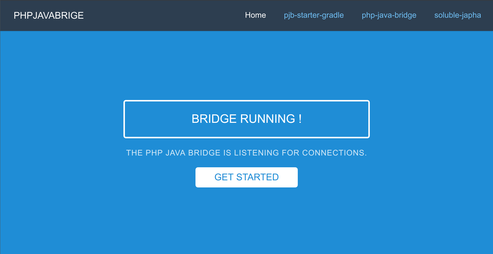

[](https://travis-ci.org/belgattitude/pjb-starter-springboot)
[](https://opensource.org/licenses/MIT)

Easy starter to package a [PHPJavaBridge](https://github.com/belgattitude/php-java-bridge) server 
with custom dependencies in minutes.    



> While both the recent [PHPJavaBridge server](https://github.com/belgattitude/php-java-bridge) fork and 
> this starter can be easily customized (in pretty much the same way), the latter features a 
> standalone `.jar` build (embedded Tomcat 8.5+) in addition to the standard `.war` file and
> offer support for [Spring boot](https://projects.spring.io/spring-boot/) for additional customizations.
> Those features comes with a cost in term of dependencies size (overhead of 11Mb comparing to barebone phpjavabridge) although no
> speed differences have been measured between both bundles. Also be aware that this starter does not register
> by default the PHPCGIServlet and thus does not require a php-cgi installation in order to run (an common issue
> when installing the bridge). While most user cases does not requires it (Java->PHP), see the FAQ for activation.     
    
## Requirements

- Java JDK 8, see [docs/install_java.md](./docs/install_java.md)
- Optionally [Tomcat](./docs/install_tomcat.md) when not using standalone.

## Features

- [x] Recent soluble [PHPJavaBridge](https://github.com/belgattitude/php-java-bridge) servlet registered.
- [x] Compatible with the [soluble-japha](https://github.com/belgattitude/soluble-japha) client.
- [x] Based on [spring boot](https://projects.spring.io/spring-boot/) with thymeleaf architecture. 
- [x] Gradle [init-scripts](https://github.com/belgattitude/pjb-starter-springboot/blob/master/init-scripts/README.md) examples for managing dependencies (jasperreports, poi, corenlp...). 
- [x] Dashboard landing page with json monitoring address.  
- [x] Build easily manageable from the command line (gradle and init-scripts).
- [x] Provides a standalone `.jar` with an embedded tomcat (in addition to standard .war file).

## Quick start

Packaging and deploying a customized PHPJavaBridge server could be done in 4 steps:
    
1. Clone the project

   ```shell
   $ git clone https://github.com/belgattitude/pjb-starter-springboot
   $ cd pjb-starter-springboot
   ```
        
2. Build the `.war` and `.jar` files 
    
   Example of build with jasperreports and mysql jdbc connector. See the '-I' parameter in the command below.
   Refer to the [init-scripts](https://github.com/belgattitude/pjb-starter-springboot/blob/master/init-scripts/README.md)
   doc for other recipes. 
    
   ```shell        
   $ ./gradlew build -I init-scripts/init.jasperreports.gradle -I init-scripts/init.mysql.gradle
   ```

   Your builded files are saved in the `build/libs` 

   ```shell
   $ ls -la build/libs
   ```
    
3. Run standalone server `.jar` from the command line (optional, skip to 4 for tomcat deployment)

   ```shell
   $ java -jar ./build/libs/JavaBridgeStandalone.jar -Dserver_port=8090
   ```

   Open your browser and check the landing page located at [http://localhost:8090](http://localhost:8090).
    
4. Alternatively deploy the `.war` on Tomcat (when not using standalone)
    
   > Tomcat deployment is the preferred way over the standalone `.jar` mode for production. While the standalone
   > is also running under tomcat (embedded tomcat 8.5+), the Tomcat provided with your OS is a better choice
   > regarding standard location of log files as well as boot startup integration.   
      
   ```shell
   cp ./build/libs/JavaBridgeTemplate.war /var/lib/tomcat8/webapps/MyJavaBridge.war
   ```        
    
   Wait few seconds and point your browser to [http://localhost:8080/MyJavaBridge](http://localhost:8080/MyJavaBridge).
          
   Note that the URI `/MyJavaBridge/` correspond to the war filename... feel free to adapt to your own needs. To re-deploy
   (deploy an updated version), simply copy the new `.war` file, Tocmat will apply the changes automatically. 
    

Don't forget to read the full documentation below, especially security considerations when exposing the PHPJavaBridge server
to the outside world, some common issues with memory in the FAQ and read the [soluble-japha](https://github.com/belgattitude/soluble-japha) doc
for PHP/Java interactions. 
         
## Documentation

### 1. Get the project

Clone the project 
 
```shell
$ git clone https://github.com/belgattitude/pjb-starter-springboot/ 
```

> If you intend contribute or want to keep a track of changes, consider making your [own fork](https://guides.github.com/activities/forking/) first and
> refer it in the clone command instead of the main project.  


### 2. Build

Call the `build` gradle task: 

```shell 
$ ./gradlew build 
```

And check the `build\libs` directory for the following files:

| File          | Description   | Approx. size |
| ------------- | ------------- | ------------ |
| `JavaBridgeStandalone.jar`  | Standalone server with an embedded tomcat. | +/- 32Mb |
| `JavaBridgeTemplate.war`    | War file, ready to drop into Tomcat webapps folder. | +/- 12Mb |

> Approx. size is given as a reference of the current default build. 

### 3. Run the PHPJavaBridge server.
 
The following example use `bootRun` task to run the server. Choose Tomcat deployment or the
standalone mode for production.

```shell
$ ./gradlew bootRun 
# or specify the port with gradle bootRun -Dserver.port=8090
```

And point your browser to [http://localhost:8090](http://localhost:8090).


### 4. Connect from PHP

Create a php project in a directory of your choice and install the [soluble-japha](https://github.com/belgattitude/soluble-japha) client.

```shell
$ composer require soluble/japha
```

Set the connection to the running phpjavabridge server (port 8090 by default)

```php
<?php

require 'vendor/autoload.php'; // for composer autoload

use Soluble\Japha\Bridge\Adapter as BridgeAdapter;

$ba = new BridgeAdapter([
    'driver' => 'Pjb62', 
    'servlet_address' => 'localhost:8090/servlet.phpjavabridge'
]);

$system = $ba->javaClass('java.lang.System');
echo  $system->getProperties()->get('java.vm_name');

```

### 5. How to distribute, run or deploy

> **WARNING** The phpjavabridge server is not supposed to be run on a public facing server
> and its use should be limited to interactions on the same host/network with the php client.
> Do not run it as root neither as it exposes the JVM methods through the network. 
> In its default configuration the pjb⁻starter example does not provide any security mechanisms
> so any url with an extension of '*.phpjavabridge' could be remotely exploited.      

#### 5.1 Standalone (embedded tomcat8)

To run simply

```shell
$ java -jar ./build/libs/JavaBridgeStandalone.jar -Dserver_port=8090 
```
And point your browser to [http://localhost:8090](http://localhost:8090) to check.


#### 5.2 Deploy on Tomcat 7/8

Copy to the Tomcat webapp directory to deploy: 

```shell
cp ./build/libs/JavaBridgeTemplate.war /var/lib/tomcat8/webapps/MyJavaBridge.war
```

wait few seconds and point your browser to [http://localhost:8080/MyJavaBridge](http://localhost:8080/MyJavaBridge).

> Note that the port may vary and the URI *(or server context)* is taken from the deployed filename. 
> In this example: 'MyJavaBridge', feel free to change.  

Repeat operation whenever you need to (re-)deploy.


### 6. Advanced customizations

Have a look a those files:

| File  | Desc |
| ------------- | ------------- |
| [build.gradle](https://github.com/belgattitude/pjb-starter-springboot/blob/master/build.gradle)  |  Customize your dependencies here (jasper...), version,... |
| [main/resources/application.yml](https://github.com/belgattitude/pjb-starter-springboot/blob/master/src/main/resources/application.yml)  | Various [spring-boot application settings](https://docs.spring.io/spring-boot/docs/current/reference/html/common-application-properties.html)  |
| [main/java/io/soluble/pssb/Application.java](https://github.com/belgattitude/pjb-starter-springboot/blob/master/src/main/java/io/soluble/pssb/Application.java)  | Where servlets, filters... are registered. |
| [settings.gradle](https://github.com/belgattitude/pjb-starter-springboot/blob/master/settings.gradle) | Customize the root project name |

Modify for your usage and rebuild with `grade bootRun` to check.

*Note that the welcome page is handled by the [main/java/io/soluble/pssb/mvc/IndexController.java](https://github.com/belgattitude/pjb-starter-springboot/blob/master/src/main/java/io/soluble/pssb/mvc/IndexController.java) with 
dependencies in the 'templates' and 'static' subdir in [resources](https://github.com/belgattitude/pjb-starter-springboot/tree/master/src/main/resources) folder.*  


## Faq

### OutOfMemory errors ?

With the self-contained tomcat

```shell
> export JAVA_OPTS=-Xmx512m -XX:MaxPermSize=128M
```
If deployed on Tomcat

```shell
$ vi /etc/default/tomcat8
```

Look for the Xmx default at 128m and increase 

```
JAVA_OPTS="-Djava.awt.headless=true -Xmx512m -XX:+UseConcMarkSweepGC"
```

and restart

```shell
sudo service tomcat8 restart
```

### How can I monitor that the bridge runs ?

The `pjb-starter-springboot` includes a very basic [PingController]((https://github.com/belgattitude/pjb-starter-springboot/blob/master/src/main/java/io/soluble/pssb/mvc/PingController.java)), you can call it on [http://localhost:8090/ping.json](http://localhost:8090/ping.json), you should see

```json
{
    "date": 1484919571831,
    "success": true,
    "message": "PHPJavaBridge running"
}
```

### How to add libraries to the builded war (jar) ?

> You can either add your dependencies directly in the `build.gradle` file 
> or use the [init-script method](https://github.com/belgattitude/pjb-starter-springboot/tree/master/init-scripts).
> The latter is preferred if you prefer to keep the `build.gradle` file intact.
 

1. Alternative 1: Use the init-script method.

    Have a look to the [init-script method](https://github.com/belgattitude/pjb-starter-springboot/tree/master/init-scripts) documentation. 

2. Alternative 2: Modify the `build.gradle` file:
    Just open the [build.gradle](./build.gradle) and
    check the runtime (or compile) sections.
    
    ```gradle
    dependencies {
        // Spring-boot stuffs
        providedRuntime "org.springframework.boot:spring-boot-starter-tomcat:${spring_boot_version}"
        testCompile "org.springframework.boot:spring-boot-starter-test:${spring_boot_version}"
        compile "org.springframework.boot:spring-boot-starter-web:${spring_boot_version}"
        compile ("org.springframework.boot:spring-boot-starter-thymeleaf:${spring_boot_version}") {
            exclude group: 'org.codehaus.groovy', module: 'groovy'
        }
        compile "org.springframework.boot:spring-boot-devtools:${spring_boot_version}"  // Useful for dev (auto disabled on prod)
        compile "com.google.code.gson:gson:2.8.0"  // Deps for the ping address
    
        // PHPJavaBridge
        compile("io.soluble.pjb:php-java-bridge:${pjb_version}") {
            // In sprint-boot, you can exclude javax.servlet and log4j
            exclude group: 'javax.servlet', module: 'javax.servlet-api'
        }
    
        /** #######################################################
         *  Here you can add runtime dependencies to the project
         *  -------------------------------------------------------
         *  Those dependencies will be included available in the
         *  builded war file. Alternatively you may register deps
         *  through the 'init-script' method.
         *  (check 'init-scripts/README.md' folder for insights)
         *  #######################################################
         */
    
        // example: mysql jdbc connector
        /*runtime "mysql:mysql-connector-java:6.+"*/
    
        // example: jasper reports
        /*
        runtime ('net.sf.jasperreports:jasperreports:6.+') {
            exclude group: 'com.lowagie' // better to use latest com.itextpdf instead
            exclude group: 'org.olap4j' // Generally don't need this
        }
        */
        
        // example: itextpdf (required for jasperreports)
        /* runtime 'com.itextpdf:itextpdf:5.5.+' */
        /* runtime 'com.itextpdf:itext-pdfa:5.5.+' */
    }
    ```
    
    Have a look to [maven repo](https://mvnrepository.com/) to quickly find your deps
    
    > For PHP users, gradle might not sound familiar. In the context of adding libraries, you
    > can consider it as a package manager like composer, npm... To add or define dependencies  
    > simply edit the dependencies section of the [build.gradle](./build.gradle) file. 
    > Generally in the 'runtime' subsection.   
 

### How to start at boot ?

If you use the Tomcat deployment it should start by default. With the self-container tomcat, ask google for "supervisord spring boot".

### BootRun support

BootRun task is really useful when developping and allows hot reloading when you customize css, html pages...

```shell
$ ./gradlew bootRun 
# or specify the port with gradle bootRun -Dserver.port=8090
```

And point your browser to [http://localhost:8090](http://localhost:8090).


### How to enable the `Java->PHP` feature ? 

By default this template does not enable `Java->PHP` by default. So if you intend to
use PHP from Java, you must add to the [Application.java](https://github.com/belgattitude/pjb-starter-springboot/blob/master/src/main/java/io/soluble/pssb/Application.java) the following methods:
  
  
```java


public class Application extends SpringBootServletInitializer {


    /// Normal initialization sequence

    /**
     * Register the php.java.servlet.fastcgi.FastCGIServlet
     * <p>
     * It replaces the following section found in the original web.xml config:
     * <p>
     * <pre>
     * {@code
     * <servlet>
     *     <servlet-name>PhpCGIServlet</servlet-name>
     *     <servlet-class>php.java.servlet.fastcgi.FastCGIServlet</servlet-class>
     *     <load-on-startup>0</load-on-startup>
     * </servlet>
     * <servlet-mapping>
     *     <servlet-name>PhpCGIServlet</servlet-name>
     *     <url-pattern>*.php</url-pattern>
     * </servlet-mapping>
     * }
     * </pre>
     */
    @Bean
    public ServletRegistrationBean phpCGIServletDispatcherRegistration() {

        FastCGIServlet phpJavaServlet = new io.soluble.pjb.servlet.fastcgi.FastCGIServlet();
        ServletRegistrationBean registration = new ServletRegistrationBean(
                phpJavaServlet);
        registration.addUrlMappings("*.php");
        registration.setLoadOnStartup(0);
        return registration;
    }

    /**
     * Register the php.java.servlet.PhpCGIFilter
     * <p>
     * This filter extend the servlet spec 2.2 "url-pattern"
     * to handle PHP PATH_INFO: *.php/something?what=that.
     * Remove it, if you don't need this feature.
     * <p>
     * <pre>
     * {@code
     * <filter>
     *     <filter-name>PhpCGIFilter</filter-name>
     *     <filter-class>php.java.servlet.PhpCGIFilter</filter-class>
     * </filter>
     * <filter-mapping>
     *     <filter-name>PhpCGIFilter</filter-name>
     *     <url-pattern>/*</url-pattern>
     * </filter-mapping>
     * }
     * </pre>
     */
    @Bean
    public FilterRegistrationBean someFilterRegistration() {
        FilterRegistrationBean registration = new FilterRegistrationBean();
        registration.setFilter(new io.soluble.pjb.servlet.PhpCGIFilter());
        registration.addUrlPatterns("/*");
        //registration.addInitParameter("paramName", "paramValue");
        registration.setName("PhpCGIFilter");
        registration.setOrder(1);
        return registration;
    }

}
  
```  

And ensure you have the [php-cgi](./docs/install_php-cgi.md) installed and available on your system. 

An example page [main/webapp/index.php](https://github.com/belgattitude/pjb-starter-springboot/blob/master/src/main/webapp/index.php) page is already provided as a starting point.... 
Try [http://localhost:8090/index.php](http://localhost:8090/index.php)


### How to enable debugging ?

Debugging can be enabled with the standalone server:

```shell
$ java -Xdebug -Xrunjdwp:server=y,transport=dt_socket,address=8000,suspend=n \
       -jar ./build/libs/JavaBridgeStandalone.jar
```

## Status
- [x] Modernized `JavaBridgeTemplate.jar` example
  - [x] JDK8, spring boot, thymeleaf.
  - [x] JavaBridgeServlet registered `PHP->Java`- (from php use the [soluble-japha](https://github.com/belgattitude/soluble-japha) client.
  - [x] PhpCGIServlet registration example `Java->PHP` (disabled by default, doc exists)        
  - [ ] Original PhpJavaBridge config properties in the original web.xml (like location of the php-cgi executable...)        
- [x] Service landing page 
  - [x] Refactored welcome landing page.
  - [x] *Ping* address for monitoring.
  - [ ] Display server/java infos
- [ ] Documentation 
  - [x] How to customize (WIP)
  - [ ] Basic security recipes, incl. bind on localhost
  - [ ] Document how to add local jar deps (out of maven)


## Contribute

Feel free to fork and submit pull requests.


## Credits

* Initially made with love by [Sébastien Vanvelthem](https://github.com/belgattitude).
* [Contribute and appears here] 

